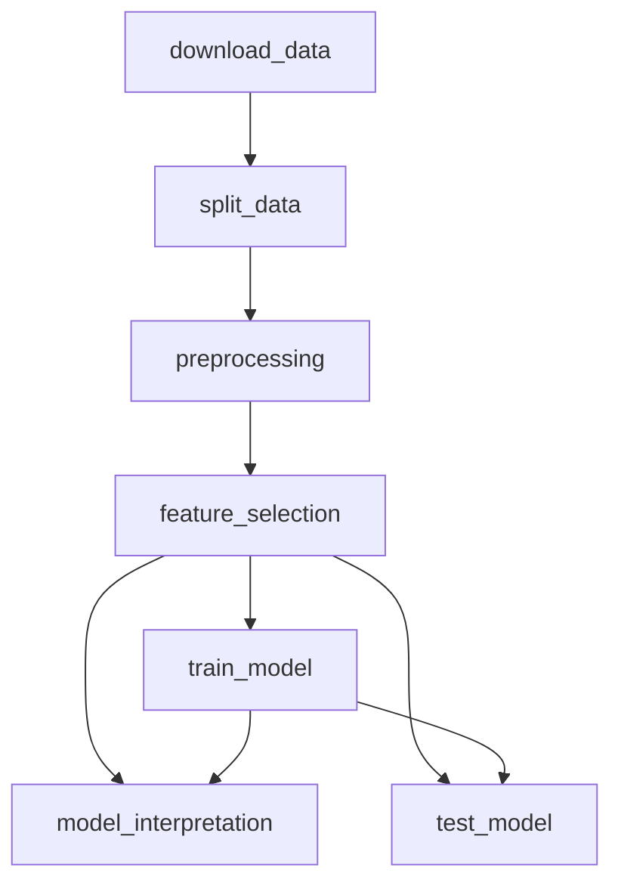

```mermaid
flowchart TD
	node1["download_data"]
	node2["feature_selection"]
	node3["model_interpretation"]
	node4["preprocessing"]
	node5["split_data"]
	node6["test_model"]
	node7["train_model"]
	node1-->node5
	node2-->node3
	node2-->node6
	node2-->node7
	node4-->node2
	node5-->node4
	node7-->node3
	node7-->node6
```
