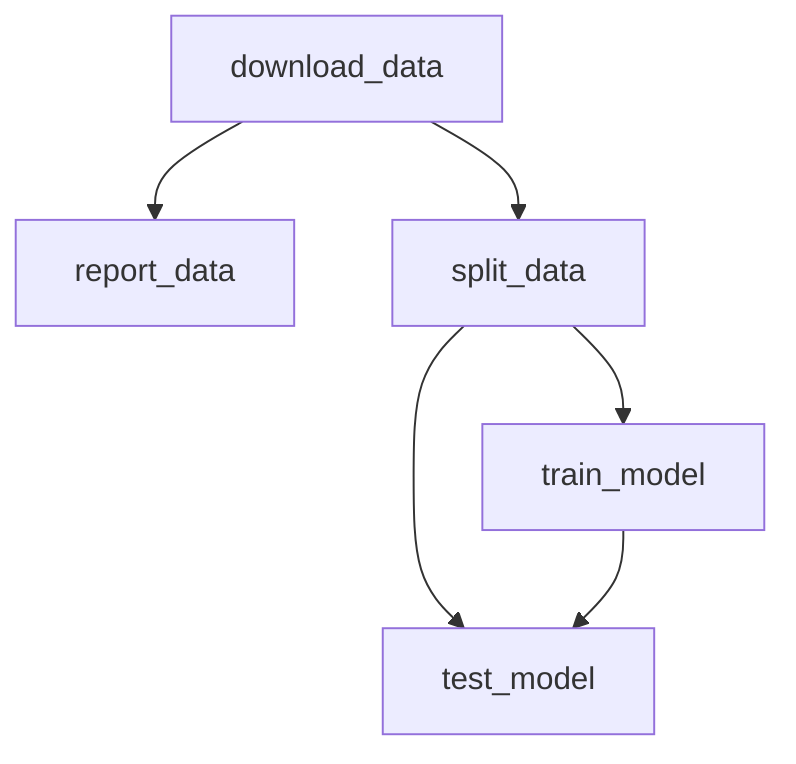

```mermaid
flowchart TD
	node1["download_data"]
	node2["report_data"]
	node3["split_data"]
	node4["test_model"]
	node5["train_model"]
	node1-->node2
	node1-->node3
	node3-->node4
	node3-->node5
	node5-->node4
```
