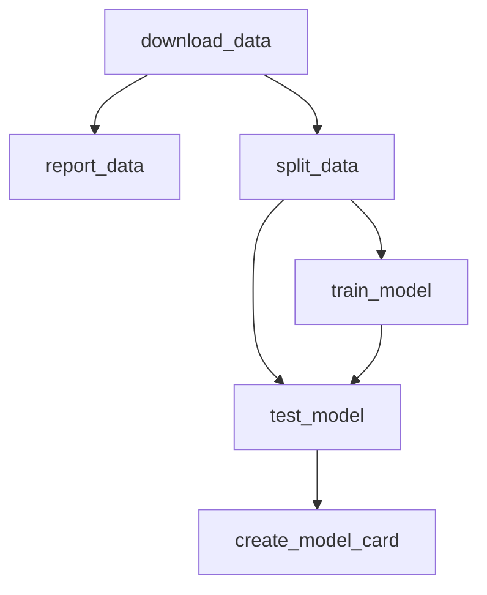

```mermaid
flowchart TD
	node1["create_model_card"]
	node2["download_data"]
	node3["report_data"]
	node4["split_data"]
	node5["test_model"]
	node6["train_model"]
	node2-->node3
	node2-->node4
	node4-->node5
	node4-->node6
	node5-->node1
	node6-->node5
```
