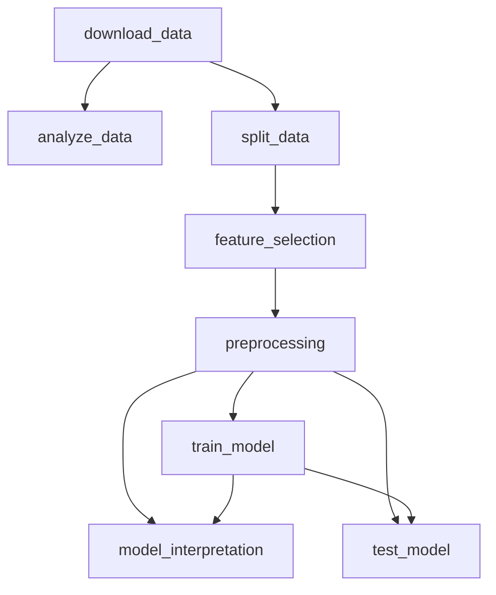

```mermaid
flowchart TD
	node1["analyze_data"]
	node2["download_data"]
	node3["feature_selection"]
	node4["model_interpretation"]
	node5["preprocessing"]
	node6["split_data"]
	node7["test_model"]
	node8["train_model"]
	node2-->node1
	node2-->node6
	node3-->node5
	node5-->node4
	node5-->node7
	node5-->node8
	node6-->node3
	node8-->node4
	node8-->node7
```
