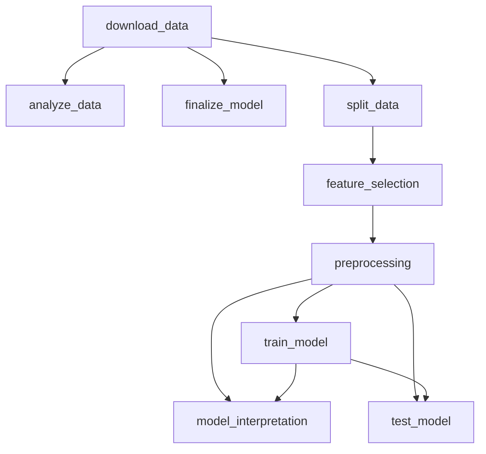

```mermaid
flowchart TD
	node1["analyze_data"]
	node2["download_data"]
	node3["feature_selection"]
	node4["finalize_model"]
	node5["model_interpretation"]
	node6["preprocessing"]
	node7["split_data"]
	node8["test_model"]
	node9["train_model"]
	node2-->node1
	node2-->node4
	node2-->node7
	node3-->node6
	node6-->node5
	node6-->node8
	node6-->node9
	node7-->node3
	node9-->node5
	node9-->node8
```
