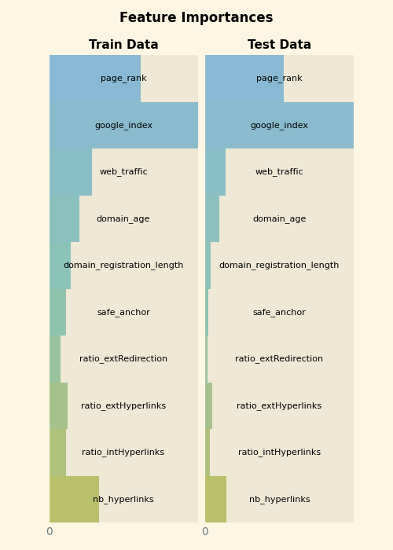

# Model description

## Training Procedure

### Hyperparameters

<details>
<summary> Click to expand </summary>

| Hyperparameter                                              | Value                    |
|-------------------------------------------------------------|--------------------------|
| memory                                                      |                          |
| steps                                                       | [('standardscaler', StandardScaler()), ('calibratedclassifiercv', CalibratedClassifierCV(cv=5, estimator=RandomForestClassifier(),<br />                       method='isotonic'))]                          |
| verbose                                                     | False                    |
| standardscaler                                              | StandardScaler()         |
| calibratedclassifiercv                                      | CalibratedClassifierCV(cv=5, estimator=RandomForestClassifier(),<br />                       method='isotonic')                          |
| standardscaler__copy                                        | True                     |
| standardscaler__with_mean                                   | True                     |
| standardscaler__with_std                                    | True                     |
| calibratedclassifiercv__base_estimator                      | deprecated               |
| calibratedclassifiercv__cv                                  | 5                        |
| calibratedclassifiercv__ensemble                            | True                     |
| calibratedclassifiercv__estimator__bootstrap                | True                     |
| calibratedclassifiercv__estimator__ccp_alpha                | 0.0                      |
| calibratedclassifiercv__estimator__class_weight             |                          |
| calibratedclassifiercv__estimator__criterion                | gini                     |
| calibratedclassifiercv__estimator__max_depth                |                          |
| calibratedclassifiercv__estimator__max_features             | sqrt                     |
| calibratedclassifiercv__estimator__max_leaf_nodes           |                          |
| calibratedclassifiercv__estimator__max_samples              |                          |
| calibratedclassifiercv__estimator__min_impurity_decrease    | 0.0                      |
| calibratedclassifiercv__estimator__min_samples_leaf         | 1                        |
| calibratedclassifiercv__estimator__min_samples_split        | 2                        |
| calibratedclassifiercv__estimator__min_weight_fraction_leaf | 0.0                      |
| calibratedclassifiercv__estimator__n_estimators             | 100                      |
| calibratedclassifiercv__estimator__n_jobs                   |                          |
| calibratedclassifiercv__estimator__oob_score                | False                    |
| calibratedclassifiercv__estimator__random_state             |                          |
| calibratedclassifiercv__estimator__verbose                  | 0                        |
| calibratedclassifiercv__estimator__warm_start               | False                    |
| calibratedclassifiercv__estimator                           | RandomForestClassifier() |
| calibratedclassifiercv__method                              | isotonic                 |
| calibratedclassifiercv__n_jobs                              |                          |

</details>

### Model Plot

This is the architecture of the model loaded by joblib.

<style>#sk-container-id-2 {color: black;}#sk-container-id-2 pre{padding: 0;}#sk-container-id-2 div.sk-toggleable {background-color: white;}#sk-container-id-2 label.sk-toggleable__label {cursor: pointer;display: block;width: 100%;margin-bottom: 0;padding: 0.3em;box-sizing: border-box;text-align: center;}#sk-container-id-2 label.sk-toggleable__label-arrow:before {content: "▸";float: left;margin-right: 0.25em;color: #696969;}#sk-container-id-2 label.sk-toggleable__label-arrow:hover:before {color: black;}#sk-container-id-2 div.sk-estimator:hover label.sk-toggleable__label-arrow:before {color: black;}#sk-container-id-2 div.sk-toggleable__content {max-height: 0;max-width: 0;overflow: hidden;text-align: left;background-color: #f0f8ff;}#sk-container-id-2 div.sk-toggleable__content pre {margin: 0.2em;color: black;border-radius: 0.25em;background-color: #f0f8ff;}#sk-container-id-2 input.sk-toggleable__control:checked~div.sk-toggleable__content {max-height: 200px;max-width: 100%;overflow: auto;}#sk-container-id-2 input.sk-toggleable__control:checked~label.sk-toggleable__label-arrow:before {content: "▾";}#sk-container-id-2 div.sk-estimator input.sk-toggleable__control:checked~label.sk-toggleable__label {background-color: #d4ebff;}#sk-container-id-2 div.sk-label input.sk-toggleable__control:checked~label.sk-toggleable__label {background-color: #d4ebff;}#sk-container-id-2 input.sk-hidden--visually {border: 0;clip: rect(1px 1px 1px 1px);clip: rect(1px, 1px, 1px, 1px);height: 1px;margin: -1px;overflow: hidden;padding: 0;position: absolute;width: 1px;}#sk-container-id-2 div.sk-estimator {font-family: monospace;background-color: #f0f8ff;border: 1px dotted black;border-radius: 0.25em;box-sizing: border-box;margin-bottom: 0.5em;}#sk-container-id-2 div.sk-estimator:hover {background-color: #d4ebff;}#sk-container-id-2 div.sk-parallel-item::after {content: "";width: 100%;border-bottom: 1px solid gray;flex-grow: 1;}#sk-container-id-2 div.sk-label:hover label.sk-toggleable__label {background-color: #d4ebff;}#sk-container-id-2 div.sk-serial::before {content: "";position: absolute;border-left: 1px solid gray;box-sizing: border-box;top: 0;bottom: 0;left: 50%;z-index: 0;}#sk-container-id-2 div.sk-serial {display: flex;flex-direction: column;align-items: center;background-color: white;padding-right: 0.2em;padding-left: 0.2em;position: relative;}#sk-container-id-2 div.sk-item {position: relative;z-index: 1;}#sk-container-id-2 div.sk-parallel {display: flex;align-items: stretch;justify-content: center;background-color: white;position: relative;}#sk-container-id-2 div.sk-item::before, #sk-container-id-2 div.sk-parallel-item::before {content: "";position: absolute;border-left: 1px solid gray;box-sizing: border-box;top: 0;bottom: 0;left: 50%;z-index: -1;}#sk-container-id-2 div.sk-parallel-item {display: flex;flex-direction: column;z-index: 1;position: relative;background-color: white;}#sk-container-id-2 div.sk-parallel-item:first-child::after {align-self: flex-end;width: 50%;}#sk-container-id-2 div.sk-parallel-item:last-child::after {align-self: flex-start;width: 50%;}#sk-container-id-2 div.sk-parallel-item:only-child::after {width: 0;}#sk-container-id-2 div.sk-dashed-wrapped {border: 1px dashed gray;margin: 0 0.4em 0.5em 0.4em;box-sizing: border-box;padding-bottom: 0.4em;background-color: white;}#sk-container-id-2 div.sk-label label {font-family: monospace;font-weight: bold;display: inline-block;line-height: 1.2em;}#sk-container-id-2 div.sk-label-container {text-align: center;}#sk-container-id-2 div.sk-container {/* jupyter's `normalize.less` sets `[hidden] { display: none; }` but bootstrap.min.css set `[hidden] { display: none !important; }` so we also need the `!important` here to be able to override the default hidden behavior on the sphinx rendered scikit-learn.org. See: https://github.com/scikit-learn/scikit-learn/issues/21755 */display: inline-block !important;position: relative;}#sk-container-id-2 div.sk-text-repr-fallback {display: none;}</style><div id="sk-container-id-2" class="sk-top-container" style="overflow: auto;"><div class="sk-text-repr-fallback"><pre>Pipeline(steps=[(&#x27;standardscaler&#x27;, StandardScaler()),(&#x27;calibratedclassifiercv&#x27;,CalibratedClassifierCV(cv=5,estimator=RandomForestClassifier(),method=&#x27;isotonic&#x27;))])</pre><b>In a Jupyter environment, please rerun this cell to show the HTML representation or trust the notebook. <br />On GitHub, the HTML representation is unable to render, please try loading this page with nbviewer.org.</b></div><div class="sk-container" hidden><div class="sk-item sk-dashed-wrapped"><div class="sk-label-container"><div class="sk-label sk-toggleable"><input class="sk-toggleable__control sk-hidden--visually" id="sk-estimator-id-6" type="checkbox" ><label for="sk-estimator-id-6" class="sk-toggleable__label sk-toggleable__label-arrow">Pipeline</label><div class="sk-toggleable__content"><pre>Pipeline(steps=[(&#x27;standardscaler&#x27;, StandardScaler()),(&#x27;calibratedclassifiercv&#x27;,CalibratedClassifierCV(cv=5,estimator=RandomForestClassifier(),method=&#x27;isotonic&#x27;))])</pre></div></div></div><div class="sk-serial"><div class="sk-item"><div class="sk-estimator sk-toggleable"><input class="sk-toggleable__control sk-hidden--visually" id="sk-estimator-id-7" type="checkbox" ><label for="sk-estimator-id-7" class="sk-toggleable__label sk-toggleable__label-arrow">StandardScaler</label><div class="sk-toggleable__content"><pre>StandardScaler()</pre></div></div></div><div class="sk-item sk-dashed-wrapped"><div class="sk-label-container"><div class="sk-label sk-toggleable"><input class="sk-toggleable__control sk-hidden--visually" id="sk-estimator-id-8" type="checkbox" ><label for="sk-estimator-id-8" class="sk-toggleable__label sk-toggleable__label-arrow">calibratedclassifiercv: CalibratedClassifierCV</label><div class="sk-toggleable__content"><pre>CalibratedClassifierCV(cv=5, estimator=RandomForestClassifier(),method=&#x27;isotonic&#x27;)</pre></div></div></div><div class="sk-parallel"><div class="sk-parallel-item"><div class="sk-item"><div class="sk-label-container"><div class="sk-label sk-toggleable"><input class="sk-toggleable__control sk-hidden--visually" id="sk-estimator-id-9" type="checkbox" ><label for="sk-estimator-id-9" class="sk-toggleable__label sk-toggleable__label-arrow">estimator: RandomForestClassifier</label><div class="sk-toggleable__content"><pre>RandomForestClassifier()</pre></div></div></div><div class="sk-serial"><div class="sk-item"><div class="sk-estimator sk-toggleable"><input class="sk-toggleable__control sk-hidden--visually" id="sk-estimator-id-10" type="checkbox" ><label for="sk-estimator-id-10" class="sk-toggleable__label sk-toggleable__label-arrow">RandomForestClassifier</label><div class="sk-toggleable__content"><pre>RandomForestClassifier()</pre></div></div></div></div></div></div></div></div></div></div></div></div>

## Evaluation Results

| Metric    |    Value |
|-----------|----------|
| accuracy  | 0.945652 |
| f1-score  | 0.945114 |
| precision | 0.951996 |
| recall    | 0.938331 |

## Test Report


## Model Interpretation

### Feature Importances



# How to Get Started with the Model

Below are some code snippets to load the model.

## With joblib (not recommended)

```python  
import joblib
import pandas as pd

urls = [
    {
        "url": "https://www.rga.com/about/workplace",
        "nb_hyperlinks": 97.0,
        "ratio_intHyperlinks": 0.969072165,
        "ratio_extHyperlinks": 0.030927835,
        "ratio_extRedirection": 0.0,
        "safe_anchor": 25.0,
        "domain_registration_length": 3571.0,
        "domain_age": 11039,
        "web_traffic": 178542.0,
        "google_index": 0.0,
        "page_rank": 5,
    },
]


model = joblib.load("models/model.pkl")

df = pd.DataFrame(urls)
df = df.set_index("url")

probas = model.predict_proba(df.values)

for url, proba in zip(urls, probas):
    print(f"URL: {url['url']}")
    print(f"Likelihood of being a phishing site: {proba[1] * 100:.2f}%")
    print("----")


# output:
# URL: https://www.rga.com/about/workplace
# Likelihood of being a phishing site: 0.89%
# ----
  
```

## With ONNX (recommended)

### Python

```python  
import numpy as np
import onnxruntime
import pandas as pd

# Defining a list of URLs with characteristics
urls = [
    {
        "url": "https://www.rga.com/about/workplace",
        "nb_hyperlinks": 97.0,
        "ratio_intHyperlinks": 0.969072165,
        "ratio_extHyperlinks": 0.030927835,
        "ratio_extRedirection": 0.0,
        "safe_anchor": 25.0,
        "domain_registration_length": 3571.0,
        "domain_age": 11039,
        "web_traffic": 178542.0,
        "google_index": 0.0,
        "page_rank": 5,
    },
]

# Initializing the ONNX Runtime session with the pre-trained model
sess = onnxruntime.InferenceSession(
    "models/model.onnx",
    providers=["CPUExecutionProvider"],
)

# Creating a DataFrame from the list of URLs
df = pd.DataFrame(urls)
df = df.set_index("url")

# Converting DataFrame data to a float32 NumPy array
inputs = df.astype(np.float32).to_numpy()


# Using the ONNX model to make predictions on the input data
probas = sess.run(None, {"X": inputs})[1]


# Displaying the results
for url, proba in zip(urls, probas):
    print(proba)
    print(f"URL: {url['url']}")
    print(f"Likelihood of being a phishing site: {proba[1] * 100:.2f}%")
    print("----")

# output:
# URL: https://www.rga.com/about/workplace
# Likelihood of being a phishing site: 0.89%
# ----
  
```

### JavaScript

```javascript  
const ort = require('onnxruntime-node');

const urls = [
    {
        "url": "http://rapidpaws.com/wp-content/we_transfer/index2.php?email=/",
        "nb_hyperlinks": 1,
        "ratio_intHyperlinks": 1,
        "ratio_extHyperlinks": 0,
        "ratio_extRedirection": 0,
        "safe_anchor": 0,
        "domain_registration_length": 338,
        "domain_age": 0,
        "web_traffic":1853,
        "google_index": 1,
        "page_rank": 2,
    },
];

async function main() {
    try {

        // Creating an ONNX inference session with the specified model
        const model_path = "./models/model.onnx";
        const session = await ort.InferenceSession.create(model_path);
        
        // Get values from data and remove url links
        const inputs = urls.map(url => Object.values(url).slice(1));
        
        // Flattening the 2D array to get a 1D array
        const flattenInputs = inputs.flat();
        
        // Creating an ONNX tensor from the input array
        const tensor = new ort.Tensor('float32', flattenInputs, [inputs.length, 10]);
        
        // Executing the inference session with the input tensor
        const results = await session.run({"X": tensor});
        
        // Retrieving probability data from the results
        const probas = results['probabilities'].data;
        
        // Displaying results for each URL
        urls.forEach((url, index) => {
            // The index * 2 + 1 is used to access the probability associated with the phishing class
            const proba = probas[index * 2 + 1];
            const percent = (proba * 100).toFixed(2);
            
            console.log(`URL: ${url.url}`);
            console.log(`Likelihood of being a phishing site: ${percent}%`);
            console.log("----");
        });
        

    } catch (e) {
        console.log(`failed to inference ONNX model: ${e}.`);
    }
};

main();

// output:
// URL: https://www.rga.com/about/workplace
// Likelihood of being a phishing site: 0.89%
// ----
  
```
